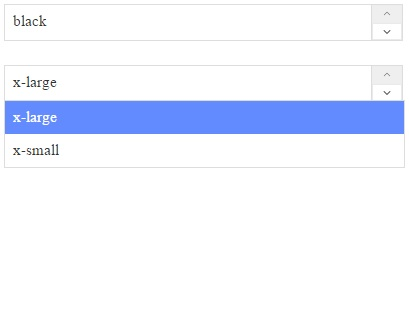

#Spinner Input
a simple js class to create drop down with spinner buttons, backed by data, no dependencies, written using plain js
using this class you can instantiate drop downs, add them to your page

